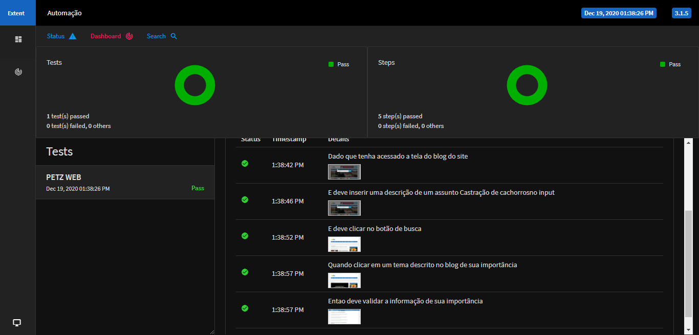

# Desafio de automação WEB PETZ

## Detalhes do projeto

Foi realizada a automação web utilizando PageObject + Maven + Java + JUnit + Cucumber + Extent Report + Selenium Webdriver + Gherkin.

## Para abrir AutomacaoWeb.html na pasta evidência de report de execução indico utilizar a IDE Intellij.

## Report de execução
Report armazenado na pasta target/evidencia/

## Deve adcionar o tilulo no método validarTextoBlog no xpath dentro de object.
# Markdown

public Boolean validarTextoBlog(){
WebElement element = driver.findElement(By.xpath("//span[contains(text(),'Quanto tempo leva e como é a recuperação da castra')]"));
Actions actions = new Actions(driver);
actions.moveToElement(element);
actions.perform();
return validarBlog.isDisplayed();
}